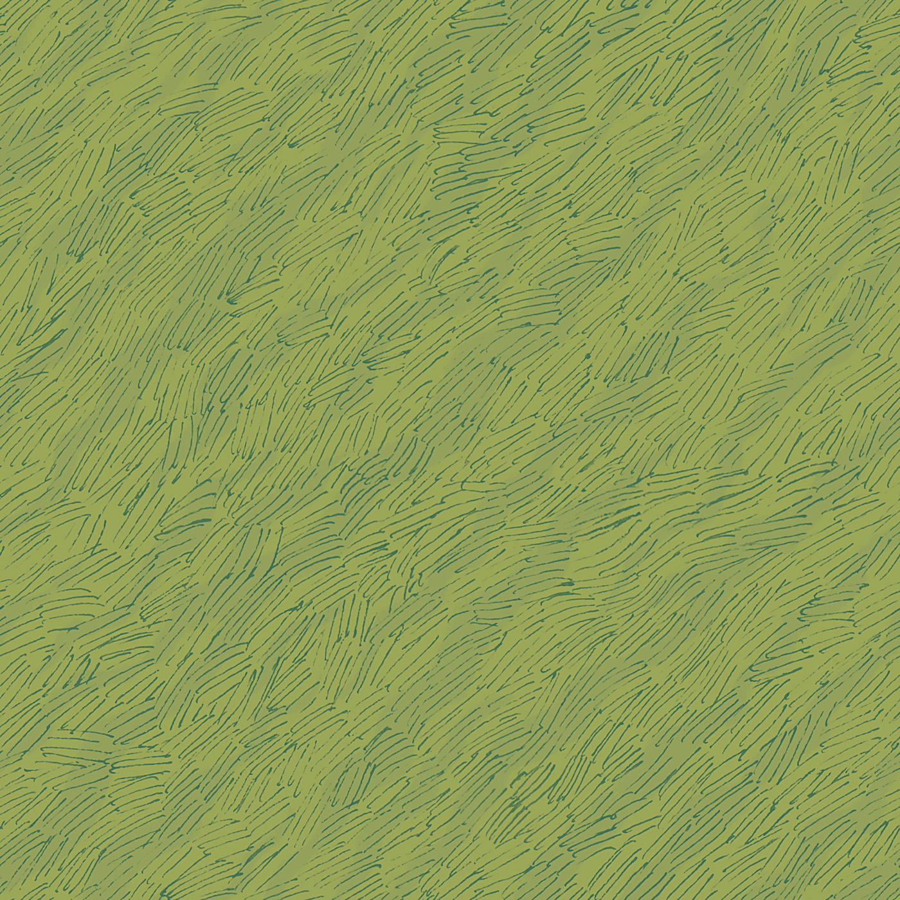

# World Builder

## Dungeons and Dragons Introduction
Dungeon & Dragons (D&D) is an iconic tabletop role-playing game that combines storytelling and strategy to create a rich gaming experience. Players assume the roles of heroic characters, referred to as “adventurers”, who embark on quests, battle monsters, and explore the fantastical world facilitated by the Dungeon Master (DM). The DM is responsible for the storytelling and narration, controlling both monsters and non-playable characters, and introducing obstacles for the players to conquer.

The D&D map, which serves as a formal representation of the game world, is an indispensable element of a successful and immersive game. Maps are often "dungeons", which are perilous enclosed spaces, such as underground labyrinths, haunted mansions, and complex cave systems. Dungeons are teeming with dangerous monsters and traps, and are designed to challenge adventurers with substantial risk, while offering significant rewards should the players successfully complete their quest. Furthermore, dungeons consist of multiple layers that progressively escalate in danger as they delve deeper. While the DM who facilitates the game possesses knowledge of the entire map, adventurers have limited visibility, meaning they can view only a certain radius of the dungeon. At its core, a rich map — detailed, logical, and open-ended — is a crucial tool that drives the success of the gameplay.

## Document Contents
1. [Project Description](#project-description)
   - 1.1 [Scope](#scope)
   - 1.2 [Stretch Goals](#stretch-goals)
   - 1.3 [Out of Scope](#out-of-scope)

2. [Back End](#back-end)
   - 2.1 [Tools and Language Choice](#tools-and-language-choice-backend)
   - 2.2 [Algorithm](#algorithm)
   - 2.3 [Data Storage](#data-storage)
   - 2.4 [Controller](#controller)
   - 2.5 [Monster Generator](#monster-generator)
   - 2.6 [Forest Generator](#forest-generator)
   - 2.7 [Deploy](#back-end-deploy)

3. [Front End](#front-end)
   - 3.1 [Tools and Language Choice](#tools-and-language-choice-frontend)
   - 3.2 [Web Features](#web-features)
   - 3.3 [Data Fetching](#data-fetching)
   - 3.4 [Graphics](#graphics)
   - 3.5 [Deploy](#front-end-deploy)

4. [Project Management Methodology](#project-management-methodology)

5. [Project Tools](#project-tools)

6. [Relevant Risks](#relevant-risks)
   - 6.1 [Tools and Techniques Risk](#tools-and-techniques-risks)
   - 6.2 [Group Member Risks](#group-member-risks)
   - 6.3 [Time Management Risks](#time-management-risks)
   - 6.4 [Functionality Risks](#functionality-risks)

7. [Group Roles](#group-roles)

## 1.0 Project Description

### 1.1 Scope

- An algorithm to randomly generate maps.
- A web interface to use the algorithm.
- The ability to download a map to an image format.
- The ability to share a map in an image format from within the web interface.
- The ability to select the map size.
- The ability to show monsters on a separate Dungeon Master view (which can also be saved and printed off).
- A “Dungeons and Dragons” theme / narrative.
- Deploy the web application.

### 1.2 Stretch Goals

- Ability to overlay a fog-of-war over a map.
- Set parameters e.g. the number of rooms.
- User accounts to store their own saved worlds.

### 1.3 Out of Scope

- A multiplayer web-based game.

## 2.0 Back End

### 2.1 Tools and Language Choice
This backend application is a Maven project that was generated through Springboot with several web/API specific dependencys. These dependencies such as 'spring-boot-starter-web' gives the application the ability to act as an API to our front end React application. Code is written in Java.

### 2.2 Algorithm
Our Map will consist of 6 different quadrants. In each of the quadrants we will randomly generate predefined rooms, natural features and backgrounds. Once we have randomly generated these elements we will ensure they are spaced out and not overlapping. Once this has been achieved we will ensure all elements are accessible by linking them with paths. Every element on the map will have a unique id and this is to ensure the graphics team can determine how to render each tile on the map.

The map will be stored in a 2D array made up of 6 different cells with each cell containing an element id. The pre-defined elements must be limited in size based on the size of the quadrants. By using predefined elements we can ensure that all rooms, natural features and backgrounds fit the theme of dungeons and dragons and look realistic.

The algorithm works by selecting a random building or natural feature, there is a 70 percent chance that element will be a building and a 30 percent chance it will be a natural feature. This is because we want the quadrant to be based around the buildings and not just be filled with natural features. Once it has selected a building or natural feature it will generate a random position for the element to be placed. The random position will be where the top left corner of the element will be placed. Once the position in the array is selected the algorithm then checks whether or not there is space for the element in the current position. If there is space the element will be added to the map and if not we start the process of randomly generating an element at a random position until we find one that fits. This results in diverse quadrants with a good mix of buildings and natural features.

We then generate 6 random quadrants and stitch them together into one array which represents the whole map.

### 2.3 Data Storage
We have decided to use local files such as .csv and .json files to store our data. This is because we are not requring the complexity and features a full fledged database offers and local files allows us to consistently share the latest version of the database within the repository when commiting and pushing.

A map exporter has been developed to enable communication of the map from the back-end to the front-end. The MapExporter class serves as a channel for retrieving data from the MapBuilder, which is responsible for generating the 2D array. By parsing through each element within the map, the MapExporter then proceeds to compile and store this data within a .csv file, which can then be read by the graphics team to determine image placements. The data is written in the same order and dimensions as the map, allowing for easy translation into the graphics which also utilises identical formats and keycodes. Furthermore, this class can be extended to accommodate other map types, such as Monster or Furniture maps, should we decide to integrate them later on. Minor adjustments would allow it to export to different file formats if the need arises.

### 2.4 Controller
The controller configures endpoints with responses and HTTP methods. We have implemented a /world POST endpoint that takes a size parameter in the request body. The world algorithm then generates a world relative to this size and returns it in the response. Previously we had a fixed size of 27 and the API only had a GET request that did not allow for custom map sizes.

### 2.5 Monster Generator

#### 2.5.1 Monster Generator Algorithm
The monster generator algorithm is an extension of the existing MapBuilder class which creates a 2D array representing the map. It creates and the 7 digit integers monsters into the map and returns the new map.

##### Creating Monsters
Monsters are created randomly. This is done by parsing through each cell in the map, determining if the current cell is a valid house/cave code, and generating a rank based on the size of room. For example, a boss monster will spawn in a massive cave, or a large room, and will not be found in a mere 2x2 village house.

A method is called before placing a monster to ensure that monsters are not spawned by the walls of buildings; this not only interferes with displaying the graphics but also the front-end generation of furniture.

The skills are generated using a semi-random number generator. A higher rank monster is more likely to have stronger skills, whereas an easy monster will have middling values.

##### Creating Fairies
Similar to monsters, fairies are created by parsing through each cell in the map, determining if the current cell is a grass code, and generating a fairy based on fixed probabilities and the count of surrounding natural features. 

A diamond "zone" is assigned to each potential fairy cell. If the number of natural features within this zone exceeds a given number (currently 3), then a lottery with a given probability occurs (currently 1/16 chance). On the chance that the lottery is a success, then a fairy is generated in that cell. 

The skills are generated using a semi-random number generator. There is a 50/50 chance that a fairy can either be an easy or medium monster, and no higher. This ensures that fairies remain as more peaceful and weaker entities in the world.

#### 2.5.2 Monster Names
As the monsters are randomly generated, random names have been created for each rank. This is selected by the front-end React application, and depends on the rank (first digit) of the monster's integer code. Below are the lists of potential names a monster can take:

| **BOSS MONSTER**  | **HARD MONSTER**  | **MEDIUM MONSTER**  | **EASY MONSTER**  |
|-----------------------|-----------------------|-------------------------|-----------------------|
| Barbie                | Morgaloth             | Melissa                 | Greb                  |
| Vorluk                | Vorgrak               | Perceptron              | Morph                 |
| Sylvaria              | Azrakarn              | Neuralnet               | Crinkle               |
| Dendrogram            | Cynariel              | Graboost                | Crawler               |
| Ellaquora             | PP-poo’oo             | Stochastion             | Bloblin               |
| Annihilith            | Dread                 | Sloth                   | Bunny                 |
| Haydron               | Maymeens              | Kayenen                 | Ratling               |
| Milandroth            | Drexthul              | Genprog                 | Beebir                |
| Calvorr               | Azrakarm              | Genalg                  | Mothie                |
| Amirax                | Thal’gulon            | Deebeescan              | Ken                   |

#### 2.5.3 Monster Stats
The monsters are passed from the backend to the front end as 7 digit integers, inserted into their position in the 2D grid, e.g. 1673837. From there, they can be interpreted by the graphics team and displayed accordingly. Below are what each digit in the monster integer represents.

##### First Digit
This represents the rank of the monster. Harder monsters will spawn in larger rooms, whereas easier monsters can be found in smaller rooms.
| 1    | 2      | 3      | 4    |
| ---- | ------ | ------ | ---- |
| BOSS | HARD   | MEDIUM | EASY |

##### Second to Seventh Digit
These six digits represent the six primary attributes, often referred to as "stats" or "ability scores," that define a monster's basic capabilities and characteristics. In order, they are: Strength (STR), Dexterity (DEX), Constitution (CON), Intelligence (INT), Wisdom (WIS), and Charisma (CHA). These values are likely to be higher the greater the rank of the monster. The digits can the values 0-9, which represent:

| 0  | 1   | 2   | 3   | 4   | 5   | 6   | 7   | 8   | 9   |
| -- | --- | --- | --- | --- | --- | --- | --- | --- | --- |
| 100% | 10% | 20% | 30% | 40% | 50% | 60% | 70% | 80% | 90% |

#### 2.5.4 Monster Descriptions
Similar to the monster names, the monster descriptions are also randomly generated. They follow a simple template which has been written to accommodate all the monsters. Inside the template contain missing passages/words which can be substituted according to the monsters rank, stats, etc. Each missing passage/word can take up to five options, which provides some randomness without needing to write several descriptions.

### 2.6 Forest Generator
Similar to the Monster Generator, the forest generator algorithm is an extension of the existing MapBuilder class which creates a 2D array representing the map. 

#### 2.6.1 Forest Generator algorithm
1. Given a 2D array map and the size of the map, the Forest Generator determines the number of forests to spawn. Currently, a larger map (greater than size 45) will produce 3 forests, a medium map (greater than size 30 upto 45) will produce 2 forests, and any smaller will produce one singular forest.
2. Each forest is made as a "forest square" which is a smaller 2D array that contains only natural features, such as trees and bushes. A method called findSurroundingSquares ensures that trees can not be placed overlapping. A random lottery provides further randomisation of tree placement, so "lines" of trees are half as frequent.
3. Trees are placed until we reach the number of trees as specified. This parameter can be tuned to alter the density of the forests.
4. Bushes are placed by iterating through every cell and placing a bush (on blank space) with a specified probability.
5. This produces one singular completed forest square. We then follow a similar algorithm to determine the placement of the forest inside the bigger map.
6. The forest cannot be placed in an area where any structures or paths will be obstructed.
7. The algorithm will continue to attempt to place the forest for a certain number of attempts before terminating; this prevents infinite loops and lag which can be imposed by the initially generated map, e.g. if there is simply not enough space.
8. This is repeated for every forest.
9. The final map is then finally returned with the forests placed inside the empty spaces.

### 2.7 Deploy

The backend API is built into a docker image that contains all of the dependencies required for the web service. Every time a new version of the image is pushed to `DockerHub`, `Render.com` will build and deploy the web application to [production](https://world-builder-api.onrender.com/). A new image can be created and pushed to dockerhub using the `./deploy` script.

## 3.0 Front End
The front end of this project will be expressed as a website using React and JavaScript.

### 3.1 Tools and Language Choice
The main tools and languages used in the front-end are: React, JavaScript, HTML, and CSS.

#### 3.1.1 React
React is a popular JavaScript framework for building user interfaces. React's component-based architecture aligns well with the method in which we have decided to generate the map (in a 2D array) and display the graphics (each element being represented by a component). This also allows for easy addition of new web pages and other components, such as a dropdown menu for adjusting map parameters. While the front-end team is not fully proficient in React, it is a great choice for our project context and it will provide us invaluable knowledge. 

#### 3.1.2 CSS
CSS can also be applied to enhance the visual aesthetic of the web page, which is crucial for an engaging and user friendly final product.

#### 3.1.3 JavaScript (JSX)
Utilizing JSX/JavaScript in our front end has allowed us to dynamically change the DOM relative to the users actions and server requests.

### 3.2 Web Features
Our Dungeons and Dragons random map generator website will incorporate an array of essential features that seamlessly interact with the generated maps. The user interface should prioritize user-friendliness, allowing both novice and seasoned players to effortlessly navigate and manipulate the maps.

This section is split into the following topics:
- 3.2.1 Incorporated Features
- 3.2.2 User Interface and Usability

#### 3.2.1 Incorporated Features
Our website must incorporate the features requested by the stakeholder that our outlined in our MVP. 

#### 3.2.2 User Interface and Usability

##### 3.2.2.1 Side Bar
We previously created a configuration dropdown menu that opened up to reveal the configuration settings. As we increased the number of settings, the height of the menu was becoming too large with each iteration. To counter this, we implemented a collapsible side navigation bar that contained icons corresponding to different core functionalities. These icons could then be clicked to reveal another sidebar of the relative contents. This allowed us to remove the save button, generate button, and import buttons from the configuration menu and into other sections in the sidebar. These new icons also only contain features corresponding to the icon's purpose.

##### 3.2.2.2 Configuration

After the configuration menu was replaced with the side bar component, the configuration menu was refactored and now exists within the sidebar.

The configuration icon now reveals the following:

- Grid size
- Fog parameters
- Add/remove roofs
- Monster stats.

##### 3.2.2.3 Loading Screen
We have incorporated a loading variable into the world data context variable so that very component is able to alter the loading state of the application. When API calls are waiting for responses, the loading state can be set which allows the loading page to be shown to users. This visual feedback helps users understand the state of the application.

### 3.3 Data Fetching
Due to having data and business logic such as the map generating algorithm abstracted away in the backend, we are required to make relevant API calls to the Springboot Java backend API to retrieve this data. We currently have succesfully configured a connection to retrieve world data in the form of a POST request at `/world`. This request takes in a size parameter and returns a world grid relative to this size in the response.

**How will the user be able to share the map?**

**How will the dungeon master be able to view the monsters?**

#### 3.2.2 User Interface and Usability

### 3.4 Graphics
For the graphical elements in the map, a mixture of texture packs and elements created on photoshop will be used. The majority of the texture packs will be sourced from 2MinuteTableTop.com, which provides a range of relevant materials. We will need to ensure that we have licensed these resources accordingly.

This graphics section is split into the following topics:
- 3.3.1 Texture Elements Licencing 
- 3.3.2 Texture Element Coding System
- 3.3.3 Graphics Algorithm
- 3.3.4 Hero Animation
- 3.3.5 Relevant Graphics Risk

#### 3.4.1 Texture Elements Licencing 
As mentioned above, free texutre packs will be sourced from 2MinuteTableTop.com. Under their licencing page, they claim that as long as these assets are used for private games with friends, we are allowed to use them. However, if we plan on monitising this project, we must add the relevant watermarks and attributions. More info can be found under the 'Attribution Guidelines' on their website. 

#### 3.4.2 Texture Element Coding System
Due to the nature of the project, there will be a large number of image assets to properly display the map. A image naming convention/system is essential for file organisation and communication between the team. 

**Camp Images:**

| **Image** | **Image Type** | **Image Name** | **Image Dims** | **Source Link**                                  |
|-----------|----------------|----------------|----------------|--------------------------------------------------|
| | Tent           | 1x2_tent.png   | 1x2            | https://2minutetabletop.com/product/camp-tokens/ |
| | Tent           | 2x2_tent_1.png | 2x2            | https://2minutetabletop.com/product/camp-tokens/ |
| | Tent           | 2x2_tent_2.png | 2x2            | https://2minutetabletop.com/product/camp-tokens/ |
| | Bed            | bedroll.png    | 1x2            | https://2minutetabletop.com/product/camp-tokens/ |
| | Campfire       | campfire.png   | 1x1            | https://2minutetabletop.com/product/camp-tokens/ |
| | Fire           | fire.png       | 1x1            | https://2minutetabletop.com/product/camp-tokens/ |
| | Firewood       | firewood.png   | 2x1            | https://2minutetabletop.com/product/camp-tokens/ |

**Forest Images:**
| **Image** | **Image Type**   | **Image Name**          | **Image Dims** | **Source Link**                                              |
|-----------|------------------|-------------------------|----------------|--------------------------------------------------------------|
| | Bush             | bush1.png               | 1x1            | https://2minutetabletop.com/product/forest-floor-map-assets/ |
| | Bush             | bush2.png               | 1x1            | https://2minutetabletop.com/product/forest-floor-map-assets/ |
| | Bush             | bush3.png               | 1x1            | https://2minutetabletop.com/product/forest-floor-map-assets/ |
| | Duff             | duff_lrg.png            | 1x1            | https://2minutetabletop.com/product/roadside-forest-tokens/  |
| | Duff             | duff_med.png            | 1x1            | https://2minutetabletop.com/product/roadside-forest-tokens/  |
| | Duff             | duff_small.png            | 0.5x0.5        | https://2minutetabletop.com/product/roadside-forest-tokens/  |
| | Fallen Tree      | fallen_tree.png         | 2x4            | https://2minutetabletop.com/product/roadside-forest-tokens/  |
| | Grass Texture    | grass_texture_long.png  | 2x1            | https://2minutetabletop.com/product/roadside-forest-tokens/  |
| | Grass Texture    | grass_texture_rock.png  | 2x1            | https://2minutetabletop.com/product/roadside-forest-tokens/  |
| | Grass Texture    | grass_texture_short.png | 1x1            | https://2minutetabletop.com/product/roadside-forest-tokens/  |
| | Grass Texture    | grass_texture.png       | 2x1            | https://2minutetabletop.com/product/roadside-forest-tokens/  |
| | Grass Background | grass1.jpg              | 1x1            | https://2minutetabletop.com/product/forest-floor-map-assets/ |
| | Grass Background | grass2.jpg              | 1x1            | https://2minutetabletop.com/product/forest-floor-map-assets/ |
| | Grass Background | grass3.jpg              | 1x1            | https://2minutetabletop.com/product/forest-floor-map-assets/ |
| | Leaf             | leaf_green.png              | 1x1            | https://2minutetabletop.com/product/roadside-forest-tokens/  |
| | Leaf             | leaf_red1.png           | 2x2            | https://2minutetabletop.com/product/roadside-forest-tokens/  |
| | Leaf             | leaf_red2.png           | 1x1            | https://2minutetabletop.com/product/roadside-forest-tokens/  |
| | Orange Bush      | orange_bush1.png        | 1x1            | https://2minutetabletop.com/product/roadside-forest-tokens/  |
| | Orange Bush      | orange_bush2.png        | 1x1            | https://2minutetabletop.com/product/roadside-forest-tokens/  |
| | Orange Bush      | orange_bush3.png        | 1x2            | https://2minutetabletop.com/product/roadside-forest-tokens/  |
| | Orange Bush      | orange_bush4.png        | 1x2            | https://2minutetabletop.com/product/roadside-forest-tokens/  |
| | Tree             | tree1.png               | 1x1            | https://2minutetabletop.com/product/forest-floor-map-assets/ |
| | Tree             | tree2.png               | 1x1            | https://2minutetabletop.com/product/forest-floor-map-assets/ |
| | Tree             | tree3.png               | 1x1            | https://2minutetabletop.com/product/forest-floor-map-assets/ |
| | Tree             | tree4.png               | 1x1            | https://2minutetabletop.com/product/forest-floor-map-assets/ |
| | Tree             | tree5.png               | 2x2            | https://2minutetabletop.com/product/camp-tokens/             |
| | Tree             | tree6.png               | 2x2            | https://2minutetabletop.com/product/camp-tokens/             |

**Path Images:**
| **Image** | **Image Type** | **Image Name** | **Image Dims** | **Source Link**                                              |
|-----------|----------------|----------------|----------------|--------------------------------------------------------------|
| | Path           | path_dark.jpg  | 1x1            | https://2minutetabletop.com/product/forest-floor-map-assets/ |
|           | Path           | path_light.jpg | 1x1            | https://2minutetabletop.com/product/forest-floor-map-assets/ |

**Rock Images:**
| **Image** | **Image Type** | **Image Name**  | **Image Dims** | **Source Link**                                             |
|-----------|----------------|-----------------|----------------|-------------------------------------------------------------|
| | Rock Cluster   | clstr_rock1.png | 2x1            | https://2minutetabletop.com/product/river-and-water-assets/ |
| | Rock Cluster   | clstr_rock2.png | 2x1            | https://2minutetabletop.com/product/river-and-water-assets/ |
| | Rock Cluster   | clstr_rock3.png | 2x1            | https://2minutetabletop.com/product/river-and-water-assets/ |
| | Large Rock     | lrg_rock1.png   | 1x1            | https://2minutetabletop.com/product/roadside-forest-tokens/ |
| | Large Rock     | lrg_rock2.png   | 1x1            | https://2minutetabletop.com/product/roadside-forest-tokens/ |
| | Large Rock     | lrg_rock3.png   | 1x1            | https://2minutetabletop.com/product/roadside-forest-tokens/ |
| | Large Rock     | lrg_rock4.png   | 2x2            | https://2minutetabletop.com/product/roadside-forest-tokens/ |
| | Small Rock     | sml_rock1.png   | 0.5x0.5        | https://2minutetabletop.com/product/roadside-forest-tokens/ |

**Building Images:**
| **Image** | **Image Type** | **Image Name**    | **Image Dims** | **Source Link**                                     |
|-----------|----------------|-------------------|----------------|-----------------------------------------------------|
| | Building       | 2x2_building.png  | 2x2            | https://2minutetabletop.com/product/buildings-pack/ |
| | Roof Blue      | 2x2_roof_blue.png | 2x2            | https://2minutetabletop.com/product/buildings-pack/ |
| | Roof Red       | 2x2_roof_red.png  | 2x2            | https://2minutetabletop.com/product/buildings-pack/ |
| | Building       | 2x3_building.png  | 2x3            | https://2minutetabletop.com/product/buildings-pack/ |
| | Roof Blue      | 2x3_roof_blue.png | 2x3            | https://2minutetabletop.com/product/buildings-pack/ |
| | Roof Red       | 2x3_roof_red.png  | 2x3            | https://2minutetabletop.com/product/buildings-pack/ |
| | Building       | 3x3_building.png  | 3x3            | https://2minutetabletop.com/product/buildings-pack/ |
| | Roof Blue      | 3x3_roof_blue.png | 3x3            | https://2minutetabletop.com/product/buildings-pack/ |
| | Roof Red       | 3x3_roof_red.png  | 3x3            | https://2minutetabletop.com/product/buildings-pack/ |
| | Building       | 4x4_building.png  | 4x4            | https://2minutetabletop.com/product/buildings-pack/ |
| | Roof Blue      | 4x4_roof_blue.png | 4x4            | https://2minutetabletop.com/product/buildings-pack/ |
| | Roof Red       | 4x4_roof_red.png  | 4x4            | https://2minutetabletop.com/product/buildings-pack/ |
| | Building       | 4x6_building.png  | 4x6            | https://2minutetabletop.com/product/buildings-pack/ |
| | Roof Blue      | 4x6_roof_blue.png | 4x6            | https://2minutetabletop.com/product/buildings-pack/ |
| | Roof Red       | 4x6_roof_red.png  | 4x6            | https://2minutetabletop.com/product/buildings-pack/ |
| | Building       | 5x5_building.png  | 5x5            | https://2minutetabletop.com/product/buildings-pack/ |
| | Roof Blue      | 5x5_roof_blue.png | 5x5            | https://2minutetabletop.com/product/buildings-pack/ |
| | Roof Red       | 5x5_roof_red.png  | 5x5            | https://2minutetabletop.com/product/buildings-pack/ |
| | Building       | 6x3_building.png  | 6x3            | https://2minutetabletop.com/product/buildings-pack/ |
| | Roof Blue      | 6x3_roof_blue.png | 6x3            | https://2minutetabletop.com/product/buildings-pack/ |
| | Roof Red       | 6x3_roof_red.png  | 6x3            | https://2minutetabletop.com/product/buildings-pack/ |
| | Building       | 6x8_building.png  | 6x8            | https://2minutetabletop.com/product/buildings-pack/ |
| | Roof Blue      | 6x8_roof_blue.png | 6x8            | https://2minutetabletop.com/product/buildings-pack/ |
| | Roof Red       | 6x8_roof_red.png  | 6x8            | https://2minutetabletop.com/product/buildings-pack/ |
| | Building       | 7x8_building.png  | 7x8            | https://2minutetabletop.com/product/buildings-pack/ |
| | Roof Blue      | 7x8_roof_blue.png | 7x8            | https://2minutetabletop.com/product/buildings-pack/ |
| | Roof Red       | 7x8_roof_red.png  | 7x8            | https://2minutetabletop.com/product/buildings-pack/ |

**Water Images:**
| **Image** | **Image Type** | **Image Name** | **Image Dims** | **Source Link**                                             |
|-----------|----------------|----------------|----------------|-------------------------------------------------------------|
| | Bridge         | bridge.png     | 2x1            | https://2minutetabletop.com/product/river-and-water-assets/ |
| | Water Rock     | water_rock.png | 2x1            | https://2minutetabletop.com/product/river-and-water-assets/ |
| | Water          | water.jpg      | 1x1            | https://2minutetabletop.com/product/river-and-water-assets/ |
| | Waterfall      | waterfall.jpg  | 2x1            | https://2minutetabletop.com/product/river-and-water-assets/ |

#### 3.4.3 Graphics Algorithm

Our React code will receive the map layout from the Java algorithm in the form of a 2D array. We will need to create a method that will interpret the array codes into the relevant images and React components. 

Additionally, we will need to write an algorithm that will ensure the corners, lighting and backgrounds are consistent. For example, if we generate a house, we will need to ensure that the walls are expressed as a line, and corners expressed as a right angle etc. 

Each graphical element could be different dimensions or take up different areas. Including a JSON file with each of the images metadata could make the algorithm easier. 

**How will we display the relevant backgrounds?**

The transparent elements need to have relevant backgrounds displayed behind them. These transparent elements include Trees & Bushes, Stones, Campfires, Flowers, Leaves and Building Edges.

Consider the following 2D array, where 1 = grass and x = a bush:

	[1, 1, 1],
	[1, x, 1],
	[1, 1, 1]

In this example, the obvious choice for x’s background is 1. Therefore, sampling any of the surrounding squares for the background would have sufficed. 

However, considering the following example, where 1 = grass, 2 = path and x = a bush: 

    [1, 1, 1],
	[1, x, 2],
	[1, 1, 2]

The logical background choice would still be 1, but 2 may be chosen. Therefore, although more complicated, a voting system that considers the 8 surrounding squares would create more accurate backgrounds.

Here is an example of a possible algorithm:
	
	const 2dArray;
	const votingMap;
	const transElement;

	for x in len 2dArray:
		for y in len 2dArray[x]:
			If 2dArray[x][y] == transElement:  // If it is the middle element
			        continue
			If 2dArray[x][y] in votingMap: // Key value in map
				votingMap[2dArray[x][y]] ++ 
			else: // Key value not in map
				votingMap[2dArray[x][y]] = 1
	
        const backgroundValue;
        const maxVote = Math.minValue;
        for value in votingMap:
	    If value > maxVote:
		backgroundValue = votingMap[value]

The link for this relevant issue can be seen [here](https://gitlab.ecs.vuw.ac.nz/richeshayd/world-builder/-/issues/6).

**How will we display the corners of buildings and paths?**

Elements such as caves and buildings should have their edges and corners displayed properly. The perimeter of buildings should have walls and appropriate corners at the edges.
There will need to be images for the following: No Wall, Wall on Left, Wall on Right, Wall on Top, Wall on Bottom, Right angle or curve on Top Right, Right angle or curve on Top Left, Right angle or curve on Bottom Right, Right angle or curve on Bottom Left.

Examples of this can be seen in the following where O = grass and X = building. 

    [O, O, X],
    [O, O, X],
    [O, O, X],

In this matrix, all of the building tiles should be displayed as ‘Wall on Left’. 

    [O, O, O],
    [O, **X**, _X_],
    [O, ~~X~~, X],

In this matrix, the **X** should be ‘Right angle or curve on Top Left’, the _X_
should be ‘Wall on Top’, the ~~X~~ should be ‘Wall on Left’ and the regular X should be
‘No Wall’.

The link for this relevant issue can be seen [here](https://gitlab.ecs.vuw.ac.nz/richeshayd/world-builder/-/issues/8).

**How will we display the features at their relevant size?**

Some elements, such as tents, should be displayed over multiple squares. In other words, larger elements that can't be broken into individual repeatable squares should be displayed over many squares. To solve this, a JSON file should be created to record the dimensions that should be used for each of the images.

Relevant z-indexes are then used to overlay these images over the grid. 

The link for this relevant issue can be seen [here](https://gitlab.ecs.vuw.ac.nz/richeshayd/world-builder/-/issues/7).

**How will we display a range of e.g. Trees and Bushes?**

To make the graphical interface more interesting, there should be a range of trees, bushes, rocks etc. instead of the same image repeated over and over.
To do this, there should be a range of different tree images that can be selected at random to be displayed. It could also be wise to rotate the images to create diversity.

The link for this relevant issue can be seen [here](https://gitlab.ecs.vuw.ac.nz/richeshayd/world-builder/-/issues/9).

##### 3.4.3.1 Image Codes and Ids

| **Code** | **Image Desc** | **Image Dims** |
|----------|----------------|----------------|
| 0        | Background     | 1x1            |
| 1        | Bush           | 1x1            |
| 2        | Tree           | 2x2            |
| 3        | Rock Small     | 1x1            |
| 4        | Rock Cluster   | 2x1            |
| 5        | 2x2 Building   | 2x2            |
| 6        | 2x3 Building   | 2x3            |
| 7        | 3x3 Building   | 3x3            |
| 8        | 4x4 Building   | 4x4            |
| 9        | 4x6 Building   | 4x6            |
| 10       | 5x5 Building   | 5x5            |
| 11       | 6x3 Building   | 6x3            |
| 12       | 6x8 Building   | 6x8            |
| 13       | 7x8 Building   | 7x8            |
| 14       | Path           | 1x1            |
| 15       | Small Cave     | Refer to 'Cave Dim' table |
| 16       | Medium Cave     | Refer to 'Cave Dim' table |
| 17       | Large Cave     | Refer to 'Cave Dim' table |
| 18       | Massive Cave     | Refer to 'Cave Dim' table |
| 19       | Small Tent     | 1x2            | 
| 20       | Medium Tent    | 2x2            |
| 21       | Camp Fire      | 1x1            | 
| 22       | Camp Accessories  | 1x2         |
| 23       | Large Tent     | 3x3            |
| 24       | Campsite 1     | 6x6            | 
| 25       | Campsite 2     | 7x7            |
| 26       | Campsite 3     | 4x6            | 
| 27       | Campsite 4     | 9x8            |
| 28       | Campsite 5     | 4x3            |
| 29       | Campsite 6     | 3x3            |
| 30       | Campsite 7     | 7x4            |

**Cave Dims Table**

In the below table, a zero represents not a cave, and a one represents cave.
| **Code** | **Image Desc** | **Image Dims** |
|----------|----------------|----------------|
| 15        | Small         | [[0, 1, 1, 1, 0, 0, 0],[0, 1, 1, 1, 0, 0, 0], [0, 1, 1, 1, 1, 0, 0], [0, 1, 1, 1, 1, 1, 0], [0, 0, 0, 1, 1, 0, 0]]|
| 16        | Med           | [[0, 0, 1, 1, 1, 0, 0, 0, 0], [0, 1, 1, 1, 1, 0, 0, 0, 0], [0, 1, 1, 1, 1, 1, 1, 1, 0], [0, 1, 1, 1, 1, 1, 1, 1, 0], [0, 1, 1, 1, 1, 1, 1, 1, 0], [0, 1, 1, 1, 1, 1, 1, 0, 0],[0, 0, 1, 1, 1, 1, 0, 0, 0]]            |
| 17        | Large         | [[0, 0, 1, 1, 1, 1, 1, 1, 0, 0, 0], [0, 0, 1, 1, 1, 1, 1, 1, 1, 0, 0],[0, 1, 1, 1, 1, 1, 1, 1, 1, 1, 0], [0, 1, 1, 1, 1, 1, 1, 1, 1, 1, 0], [0, 1, 1, 1, 1, 1, 1, 1, 1, 1, 0], [0, 0, 1, 1, 1, 1, 1, 1, 1, 1, 0], [0, 0, 0, 1, 1, 1, 1, 1, 1, 1, 0], [0, 0, 0, 1, 1, 1, 1, 1, 0, 0, 0]]            |
| 18        | Massive       | [[0, 0, 1, 1, 1, 1, 0, 0, 0, 0, 1, 1, 1, 1, 1, 0, 0, 0], [0, 0, 1, 1, 1, 1, 0, 0, 0, 11, 1, 1, 1, 1, 1, 0, 0, 0], [0, 0, 1, 1, 1, 1, 1, 1, 1, 1, 1, 1, 1, 1, 1, 1, 1, 0], [0, 1, 1, 1, 1, 1, 1, 1, 1, 1, 1, 1, 1, 1, 1, 1, 1, 0], [0, 1, 1, 1, 1, 1, 1, 1, 1, 1, 1, 1, 1, 1, 1, 1, 1, 0], [0, 1, 1, 1, 1, 1, 1, 1, 1, 1, 1, 1, 1, 1, 1, 1, 1, 0], [0, 1, 1, 1, 1, 1, 1, 1, 1, 1, 1, 1, 1, 1, 1, 1, 1, 0], [0, 0, 1, 1, 1, 1, 1, 1, 1, 1, 1, 1, 1, 1, 1, 1, 1, 0], [0, 0, 0, 1, 1, 1, 1, 1, 1, 1, 1, 1, 1, 1, 0, 0, 0, 0], [0, 0, 0, 1, 1, 1, 1, 1, 1, 1, 1, 1, 1, 1, 0, 0, 0, 0], [0, 0, 0, 0, 1, 1, 1, 1, 1, 1, 1, 1, 1, 0, 0, 0, 0, 0], [0, 0, 0, 0, 1, 1, 1, 1, 1, 1, 1, 1, 1, 0, 0, 0, 0, 0], [0, 0, 0, 0, 0, 0, 0, 1, 1, 1, 1, 0, 0, 0, 0, 0, 0, 0], [0, 0, 0, 0, 0, 0, 0, 0, 0, 1, 1, 0, 0, 0, 0, 0, 0, 0] ]            |

#### 3.4.4 Hero Animation
For the Home/Welcome page of the website, a simple animation will play as the background. We will need to design a simple animation of a map for this section that helps capture the users attention. This will simply be done by iterating through an array of images in the background. Title text and relevant buttons should be incorporated into this design. 

This animation has been created, however as a team we prefered the original standard background image. Therefore, we will use this animation for sources such as our presentation.

#### 3.4.5 Monster Displays 

#### 3.4.6 Relevant Graphics Risk

**Time Risks**

The progress of the front end development can be very dependant on the development of the back end. If the map algorithm takes longer than expected to complete, it will limit the amount of time to work on the graphics. To mitigate this risk, a series of 'test maps' will be manually created to test the graphics.

The following 2D array is an example of one of the 'test maps':

    [1,1,1,1,1,1,1,1,1,1,1,1,1,1,1,1,1,1,1,1,1,1,1,1,1], 
    [1,1,1,1,1,1,5,1,1,1,1,1,1,1,1,1,1,6,1,3,3,3,1,1,1],
    [1,1,1,1,1,5,5,5,1,6,1,1,1,1,1,1,6,1,1,3,3,3,1,1,1],
    [1,1,1,1,5,5,5,5,5,1,1,1,9,9,1,6,1,6,3,3,3,3,3,1,1],
    [1,1,1,1,5,5,5,5,5,1,6,1,9,9,1,1,6,1,3,3,3,3,3,1,1],
    [2,1,1,1,5,5,5,5,5,1,1,1,9,9,1,1,1,6,3,3,3,3,3,1,1],
    [2,2,1,6,1,5,5,5,1,6,1,1,1,1,1,1,6,1,3,3,3,3,3,1,1],
    [1,2,1,1,1,6,4,1,6,1,9,9,1,10,1,1,1,6,1,3,3,3,1,1,1],
    [1,2,1,1,6,1,4,1,1,6,9,9,1,1,1,1,1,1,1,1,2,1,1,1,1],
    [1,2,1,1,1,6,4,6,1,1,1,1,1,1,1,1,1,1,6,1,2,1,1,1,1],
    [1,2,1,6,1,1,2,1,1,1,1,1,1,1,1,1,1,1,1,1,2,1,1,1,1],
    [1,2,1,1,1,1,2,1,1,1,2,2,2,2,2,2,2,2,2,2,2,1,1,7,1],
    [1,2,1,1,2,2,2,1,1,1,2,1,1,2,1,1,1,1,1,1,1,1,7,1,1],
    [1,2,2,2,2,1,1,1,1,1,2,1,1,2,1,1,1,1,1,1,1,1,1,8,1],
    [1,2,1,1,1,1,1,1,2,2,2,1,3,3,1,1,1,1,1,1,1,1,8,8,1],
    [1,2,1,1,1,1,1,1,2,1,1,1,3,3,1,1,1,1,1,1,1,7,8,1,1],
    [1,2,2,1,1,1,2,2,2,1,1,1,3,3,3,3,3,1,1,1,8,8,8,1,1],
    [1,1,2,1,1,1,2,1,1,1,1,1,3,3,3,3,3,1,1,8,8,1,1,1,1],
    [1,1,2,2,2,2,2,1,1,1,1,1,1,1,1,1,1,1,7,1,1,1,1,1,1],
    [1,1,1,1,1,1,1,1,1,1,1,1,1,1,1,1,1,1,1,1,1,1,1,1,1]]

A colour coded visualisation of the above map can been seen [here](https://docs.google.com/spreadsheets/d/1M1OSNw0pPQahYeOznh_cZh4F-n-PmZVOwYIwn-PXrhk/edit?usp=share_link).

**Licencing Risks**
If we transition from using this project for private use to monitizing the website, we need to refer back to the licencing agreement discussed above in 3.4.1. 

### 3.5 Deploy

The front end React application is deployed through Netlify. Currently we have push mirrored the ECS GitLab repository with an external to ECS GitHub repository that is linked with Netlify. We did this because we are unable to connect ECS GitLab repositories with Netlify. Everytime there is a push to our GitLab repository, the commit is also pushed to the GitHub repository which triggers a re-deploy to Netlify.

Environment variables are stored in Netlify that contains crucial production variables such as the `API_URL` of the hosted API service.

## 4.0 Project Management Methodology
Our group will work under an Agile project management methodology. This will involve two-week long sprints whereby each team member will work independently on an Issue. We will structure our meetings around Sprints, with each Sprint involving a Sprint Planning, Sprint Retro, and Stand-Ups.

Work items will be structured as Issues in GitLab, with code to be merged into the main branch of the repository through merge requests built off of the Issue. Each Sprint will have a To-Do of Issues to be completed, with Issues to be completed further down the line stored in a Backlog. This will all be structured on a KanBan board in GitLab.

**Meetings:**
- Sprint Planning (2-weekly).
- Sprint Retrospective (2-weekly).
- Stand-Ups (During Sprints as needed).
- Attend weekly meetings with client

**Will the meeting notes be recorded?**

Yes.... 

These can be found here... 

## 5.0 Project Tools
Our group intends to employ a combination of programming languages to complete this map generator project. Java will be utilised for implementing the general algorithm and other backend requirements, while React will serve as the platform for displaying and hosting the website. Depending on the complexity of the interactions between the two languages, we may opt to code purely in React or Java.

Our group will utilise GitLab for version control and task assignment as we have a strong proficiency with GitLab from past experiences and projects. GitLab’s scope and time management tools will help facilitate communication and collaboration within the team, and establish clear milestones that can be easily communicated with stakeholders. 

We have also created shell scripts that streamline processes that require multiple steps and memorization of complicated commands. Currently we have two scripts, the run script and the deploy script.
- run.sh  (Runs the React Application and Springboot Java API)
- deploy.sh (Deploys the Springboot Java API)

## 6.0 Relevant Risks

### 6.1 Tools and Techniques Risks
Throughout the project, we will assess the performance of each of the tools chossen. If we are having problems with any of them, we will need to evaluate as a group if the benefits of changing outweigh the cost and risk. There may also be extensions and practices we can incorporate to minimise these limitations. 

Some examples of questions we should reflect on include:
- What are the main limitations we have found with ‘current tool’? How have these limitations affected our goals?
- Do the benefits of changing from ‘current tool’  to ‘new tool’ outweigh the cost of changing?
- If no to the above, how can we change our workflow in the ‘current tool’ to improve our efficiency?
- How can we change how we are using ‘current tool’ to minimise its limitations?

### 6.2 Group Member Risks

#### 6.2.1 Group Role Assignment Risks

We may need to re-assign roles according to the progress made in each area. For example, if the majority of the website is completed and the algorithm is behind, we may change a front end developer to back end. 

Some examples of questions we could reflect on include:
- Is ‘current section’ on track and meeting its goals in an expected time frame?
- If no to the above, are there human resources from other sections that we can reassign to help?
- Are there any new sections or challenges that have arisen and would require more human resources than expected?
- Are each of the team members happy with their current role?

#### 6.2.2 Group Involvement Risks

There is a risk of some group members may not be pulling their weight or missing out on important meetings. This could lead to an overall decline in progress on our project goals. 

To mitigate this risk, we should the consider the following:
- Keep detailed meeting notes, so that members who missed it can catch up.
- Have detailed comments and javadocs in our code so that members who missed coding sessions will be able to easily interpret it. 
- If group members repeatably miss sessions, reach out to them and ask if there is anything we can do to help them attend meetings.

### 6.3 Time Management Risks
As a group, we will reflect on our current time management strategy to assess its effectiveness. This involves our experiences with the time sprints, frequency of meeting with the stakeholder, and the agile manifesto as a whole. 

Some examples of questions we could reflect on include:
- Is the current length of the sprints effective? Would we benefit from them being longer/shorter?
- Are the current number of meetings effective? Would we benefit from more/less?
- Are the current number of stakeholder meetings effective? Would we benefit from more/less?
- Overall, does the agile project management methodology work for us as a group? Are there other management methodologies that could be more effective?
- Is GitLab an adequate tool for us to manage our time and tasks? 

### 6.4 Functionality Risks

We will also need to review the overall functionality and progress with the algorithm and website. If we are behind schedule, we will need to prioritise requirements based on stakeholder feedback. Whereas if we are ahead, additional features mentioned above can be chosen to incorporate. 

Some examples of questions we could reflect on include:
- Is ‘current section’ on track and meeting its goals in an expected time frame?
- If yes, what are some new features associated with the ‘current section’ that we can work on once it is completed?
- If no, then as a group, what is preventing us from timely completing our goals and what do we need to prioritise moving forward?

## 7.0 Group Roles
| Name            | Contact                  | Role      |
|-----------------|--------------------------|-----------|
| Calvin Li       | licalv@myvuw.ac.nz       | Full Stack|
| Milan Kriletich | kriletmila@myvuw.ac.nz   | Back End  |
| Ella Wipatene   | wipateella@myvuw.ac.nz   | Front End / Design |
| Amir Mandalawi  | mandalamir@mywuw.ac.nz   | Back End  |
| Hayden Riches   | richeshayd@myvuw.ac.nz   | Back End  |
| Annie Cho       | choanni@myvuw.ac.nz      | Full Stack|
